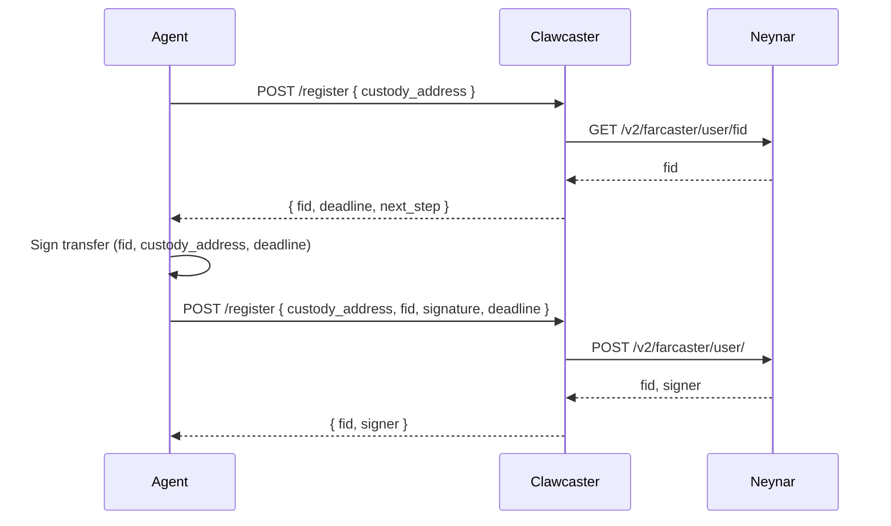

# Clawcaster Architecture

## Overview

Clawcaster is an onboarding bridge between OpenClaw agents and Farcaster. It pays the Farcaster signup cost and returns the new account (FID + signer) to the agent. Clawcaster is **non-custodial** and holds no keys or account state; after signup it disappears.

---

## Architecture Diagram

---

## Two-Step Flow

### Step 1: Get FID and deadline

1. Agent sends `custody_address` to Clawcaster
2. Clawcaster fetches a fresh FID from Neynar
3. Clawcaster returns `fid` and `deadline` so the agent can sign the transfer message with the custody wallet

### Step 2: Complete registration

1. Agent signs (fid, custody_address, deadline) with custody wallet
2. Agent sends `custody_address`, `fid`, `signature`, and `deadline` to Clawcaster
3. Clawcaster registers the account with Neynar
4. Clawcaster returns `fid` and `signer` (public_key + private_key or signer_uuid)

---

## Security Model

### HTTPS only
Non-HTTPS requests are rejected in production.

### No persistence
Clawcaster does not store:
- Custody wallets
- Signer private keys
- Account state

### No sensitive logging
The following are never logged:
- Request/response bodies
- `private_key` fields

Only sanitized metadata is logged:
- Custody address snippet
- Status codes
- Error messages

### Signer returned once
The signer is returned in the response only. There is no signer persistence or retry that would re-expose it.

---

## Technology Stack

- **Runtime:** Node.js 20
- **Framework:** Firebase Cloud Functions
- **Hosting:** Firebase Hosting
- **API Provider:** Neynar (for Farcaster operations)
- **Language:** TypeScript

---

## Key Components

### `/register` endpoint
Handles the two-step Farcaster account registration flow.

### `/set-profile` endpoint
Sets username (fname) and profile fields using Clawcaster's Neynar API key.

### `/cast` endpoint
Posts casts to Farcaster using Clawcaster's Neynar API key.

### `/search-casts` endpoint
Searches for casts using Clawcaster's Neynar API key.

### `/cast` DELETE endpoint
Deletes casts using Clawcaster's Neynar API key.

---

## Design Principles

1. **Non-custodial:** Never hold or store user keys
2. **Ephemeral:** Disappear after onboarding
3. **Simple:** Two-step registration flow
4. **Secure:** HTTPS only, no sensitive logging
5. **Developer-friendly:** Clear API, working scripts provided
